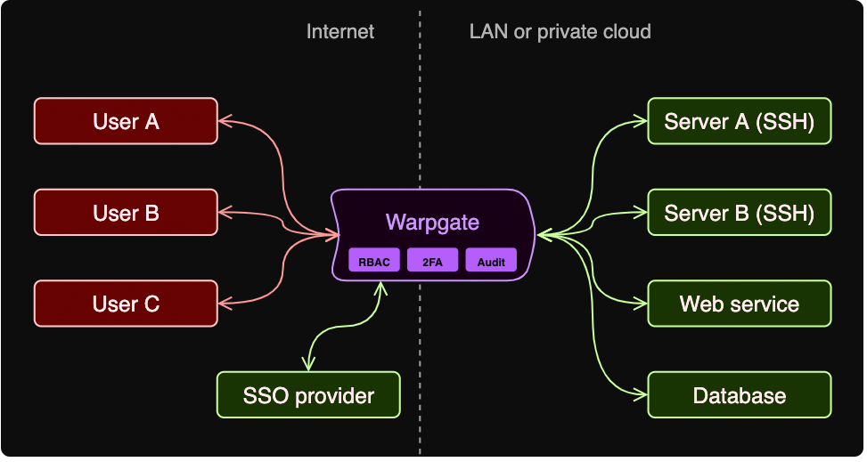

 

 

 &nbsp;  &nbsp; 

  

---

Warpgate is a smart SSH, HTTPS and MySQL bastion host for Linux that doesn't need special client apps.

* Set it up in your DMZ, add user accounts and easily assign them to specific hosts and URLs within the network.
* Warpgate will record every session for you to view (live) and replay later through a built-in admin web UI.
* Not a jump host - forwards your connections straight to the target instead.
* Native 2FA and SSO support (TOTP & OpenID Connect)
* Single binary with no dependencies.
* Written in 100% safe Rust.

## Getting started & downloads

* See the [Getting started](https://github.com/warp-tech/warpgate/wiki/Getting-started) wiki page (or [Getting started on Docker](https://github.com/warp-tech/warpgate/wiki/Getting-started-on-Docker)).
* [Release / beta binaries](https://github.com/warp-tech/warpgate/releases)
* [Nightly builds](https://nightly.link/warp-tech/warpgate/workflows/build/main)

      

<table>
  <tr>
  <td>
    

  </td>
  <td>
    

  </td>
  </tr>
</table>

## Project Status

The project is currently in **alpha** stage and is gathering community feedback. See the [official roadmap](https://github.com/orgs/warp-tech/projects/1/views/2) for the upcoming features.

In particular, we're working on:

* Requesting admin approvals for sessions
* Support for tunneling PostgreSQL connections,
* and much more.

## How it works

Warpgate is a service that you deploy on the bastion/DMZ host, which will accept SSH, HTTPS and MySQL connections and provide an (optional) web admin UI.

Run `warpgate setup` to interactively generate a config file, including port bindings. See [Getting started](https://github.com/warp-tech/warpgate/wiki/Getting-started) for details.

It receives connections with specifically formatted credentials, authenticates the user locally, connects to the target itself, and then connects both parties together while (optionally) recording the session.

When connecting through HTTPS, Warpgate presents a selection of available targets, and will then proxy all traffic in a session to the selected target. You can switch between targets at any time.

You manage the target and user lists and assign them to each other through a config file (default: `/etc/warpgate.yaml`), and the session history is stored in an SQLite database (default: in `/var/lib/warpgate`).

You can use the admin web interface to view the live session list, review session recordings, logs and more.

## Contributing / building from source

* You'll need Rust, NodeJS and Yarn
* Clone the repo
* [Just](https://github.com/casey/just) is used to run tasks - install it: `cargo install just`
* Install the admin UI deps: `just yarn`
* Build the frontend: `just yarn build`
* Build Warpgate: `cargo build` (optionally `--release`)

The binary is in `target/{debug|release}`.

### Tech stack

* Rust 🦀
  * HTTP: `poem-web`
  * Database: SQLite via `sea-orm` + `sqlx`
  * SSH: `russh`****
* Typescript
  * Svelte
  * Bootstrap

## Contributors ✨

Thanks goes to these wonderful people ([emoji key](https://allcontributors.org/docs/en/emoji-key)):

<!-- ALL-CONTRIBUTORS-LIST:START - Do not remove or modify this section -->
<!-- prettier-ignore-start -->
<!-- markdownlint-disable -->
<table>
  <tr>
    <td align="center"><a href="https://github.com/Eugeny"> <b>Eugeny</b></a> <a href="https://github.com/Eugeny/warpgate/commits?author=Eugeny" title="Code">💻</a></td>
    <td align="center"><a href="https://the-empire.systems/"> <b>Spencer Heywood</b></a> <a href="https://github.com/Eugeny/warpgate/commits?author=heywoodlh" title="Code">💻</a></td>
    <td align="center"><a href="https://github.com/apiening"> <b>Andreas Piening</b></a> <a href="https://github.com/Eugeny/warpgate/commits?author=apiening" title="Code">💻</a></td>
  </tr>
</table>

<!-- markdownlint-restore -->
<!-- prettier-ignore-end -->

<!-- ALL-CONTRIBUTORS-LIST:END -->

This project follows the [all-contributors](https://github.com/all-contributors/all-contributors) specification. Contributions of any kind welcome!
